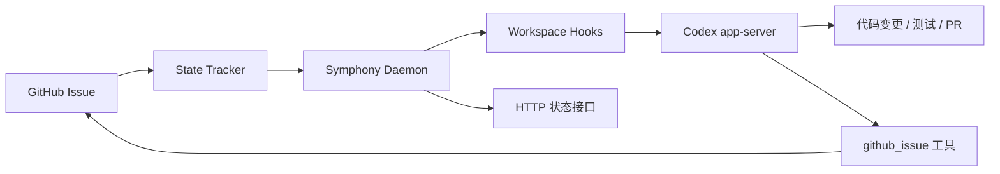

# Symphony 部署与使用手册

本文档面向负责接入和日常维护 Symphony 的开发者，覆盖从部署、配置到实际使用的完整流程。当前版本以 GitHub Issue 为任务入口，以 Codex `app-server` 为执行引擎，把每个 Issue 转换成一个可恢复、可观察的自动化工作流。

## 1. 工作流概览

Symphony 的运行链路如下：



核心思路：

- GitHub Issue 是任务队列。Issue 的 label 或 Projects v2 `Status` 字段表示状态。
- Symphony 定期轮询可执行状态，例如 `Todo`、`In Progress`、`Rework`。
- 每个 Issue 分配一个独立 workspace，先执行 hook，再启动 Codex `app-server`。
- Codex 根据 `WORKFLOW.md` 的 prompt 执行任务，并通过 `github_issue` 工具更新 Issue 评论、状态、PR 链接和失败信息。
- Symphony 暴露本地 HTTP 状态接口，用于查看健康状态、当前队列和单个任务进度。

当前版本适合先作为单机 daemon 使用。它已经具备 labels 模式、Projects v2 模式、workspace hooks、重试退避、状态恢复和 HTTP observability，但还不是多租户平台，也没有内置远程 worker 编排。

## 2. 部署形态

推荐从 labels 模式开始：

- 最小部署：一台开发机或一台可信 VM，运行一个 `symphony` 二进制。
- 任务来源：GitHub Issues。
- 状态来源：`symphony:*` labels。
- 执行环境：本机 Git、Cargo、Codex CLI、GitHub token。

需要跨团队协作时，再切到 Projects v2 模式：

- 任务仍然是 GitHub Issues。
- 状态来自 GitHub Projects v2 的单选 `Status` 字段。
- 适合已有项目看板、需要 PM 或非工程成员统一排期的团队。

不建议当前阶段直接做的事情：

- 把 Symphony 暴露成公网服务。
- 在含有生产密钥的机器上运行 agent。
- 让多个 daemon 同时处理同一批 Issue，除非你已经通过状态、标签或仓库范围做了隔离。

## 3. 前置条件

部署机器需要具备：

- Rust 工具链，可以执行 `cargo build --release`。
- Codex CLI，并且本机可以运行 `codex app-server --help`。
- GitHub token，至少需要读写 Issue。使用 Projects v2 时还需要 Project 读写权限。
- Git 和仓库访问权限。hook 里如果使用 SSH clone，需要先配置 SSH key。
- 可选但强烈建议安装 `gh`，方便创建 labels、检查 Issue 和创建 PR。

检查命令：

```bash
rustc --version
cargo --version
codex app-server --help
gh auth status
git --version
```

GitHub token 建议：

- 只授予目标组织或目标仓库所需权限。
- labels 模式通常需要 Issues read/write。
- Projects v2 模式需要 Issues read/write、Projects read/write；classic PAT 通常需要 `repo`、`read:org`、`project`。
- 如果 prompt 里要求 Codex 使用 `gh pr create`，请让 agent 进程也能访问 `GH_TOKEN` 或已登录的 `gh` 凭据。

## 4. 安装 Symphony

从 GitHub 拉取并构建：

```bash
git clone git@github.com:Room-C/symphony.git
cd symphony
git checkout v0.1.0
cargo build --release
```

验证配置文件可以被解析：

```bash
GITHUB_TOKEN=dummy ./target/release/symphony check --workflow WORKFLOW.md
```

开发调试也可以直接使用：

```bash
cargo run -- check --workflow WORKFLOW.md
cargo run -- run --workflow WORKFLOW.md --http-bind 127.0.0.1:8723
```

## 5. 配置 labels 模式

labels 模式是当前最简单、验证最充分的接入方式。Issue 是否可执行由 label 决定。

Symphony 不会自动创建 GitHub labels。首次接入某个仓库时，需要手动初始化这些 label；如果 label 已经存在，只需要用 `gh label edit` 更新颜色或描述。

建议创建这些状态 label。配色按 GitHub 原生 issue 配色规范设计，遵循"明度递进"语义：浅色表示待领取，饱和色表示进行中，灰色表示终态。

```bash
gh label create "symphony:todo" --color "BFD4F2" --description "Ready for Symphony"
gh label create "symphony:in-progress" --color "1D76DB" --description "Currently handled by Symphony"
gh label create "symphony:rework" --color "FBCA04" --description "Needs another Symphony pass"
gh label create "symphony:human-review" --color "8957E5" --description "Waiting for human review"
gh label create "symphony:done" --color "0E8A16" --description "Completed by Symphony"
gh label create "symphony:closed" --color "CFD3D7" --description "Closed"
gh label create "symphony:cancelled" --color "5C5C5C" --description "Cancelled"
```

如果这些 label 已经存在，用下面命令同步推荐配色：

```bash
gh label edit "symphony:todo" --color "BFD4F2" --description "Ready for Symphony"
gh label edit "symphony:in-progress" --color "1D76DB" --description "Currently handled by Symphony"
gh label edit "symphony:rework" --color "FBCA04" --description "Needs another Symphony pass"
gh label edit "symphony:human-review" --color "8957E5" --description "Waiting for human review"
gh label edit "symphony:done" --color "0E8A16" --description "Completed by Symphony"
gh label edit "symphony:closed" --color "CFD3D7" --description "Closed"
gh label edit "symphony:cancelled" --color "5C5C5C" --description "Cancelled"
```

优先级 label 可选：

```bash
gh label create "priority:1" --color "B60205" --description "Highest priority"
gh label create "priority:2" --color "D93F0B" --description "High priority"
gh label create "priority:3" --color "FBCA04" --description "Normal priority"
gh label create "priority:4" --color "C2E0C6" --description "Low priority"
```

最小 `WORKFLOW.md` 配置：

```yaml
---
version: 1
tracker:
  kind: github
  mode: labels
  owner: Room-C
  repo: symphony
  api_key: $GITHUB_TOKEN
  active_states: [Todo, "In Progress", Rework]
  terminal_states: [Done, Closed, Cancelled]

polling:
  interval_ms: 30000

workspace:
  root: ~/code/symphony-workspaces
  hooks:
    after_create: |
      git clone --depth 1 git@github.com:Room-C/symphony.git .
      cargo fetch

agent:
  max_concurrent_agents: 3
  max_turns: 10

codex:
  command: codex app-server
  approval_policy: never
  thread_sandbox: danger-full-access
  turn_sandbox_policy: danger-full-access
  read_timeout_ms: 30000

observability:
  http_bind: 127.0.0.1:8723
  json_logs: true
---

You are working on {{issue.identifier}}.

Title: {{issue.title}}
State: {{issue.state}}
Priority: {{issue.priority}}
URL: {{issue.url}}

Task:
{{issue.description}}

Implement the issue in this workspace, run focused verification, then use the
github_issue tool to add a concise result comment and move the issue to
Human Review or Done. If blocked, comment with the blocker and keep the issue
actionable.
```

状态映射规则：

- `Todo` 对应 label `symphony:todo`。
- `In Progress` 对应 label `symphony:in-progress`。
- `Human Review` 对应 label `symphony:human-review`。
- 空格会转换成 `-`，大小写不敏感。
- `active_states` 中的状态会被轮询并分发。
- `terminal_states` 中的状态会被视为结束态，daemon 会释放本地 claim。

## 6. 配置 Projects v2 模式

如果团队已经使用 GitHub Projects v2，可以把状态源切到 Project。

Project 需要满足：

- Issue 已加入目标 Project。
- 有一个单选字段，例如 `Status`。
- 字段选项和 `active_states`、`terminal_states` 使用同一组业务状态，例如 `Todo`、`In Progress`、`Human Review`、`Done`。

示例配置：

```yaml
---
version: 1
tracker:
  kind: github
  mode: projects_v2
  owner: Room-C
  repo: symphony
  org: Room-C
  project_number: 1
  status_field: Status
  api_key: $GITHUB_TOKEN
  active_states: [Todo, "In Progress", Rework]
  terminal_states: [Done, Closed, Cancelled]

polling:
  interval_ms: 30000

workspace:
  root: ~/code/symphony-workspaces

codex:
  command: codex app-server
---

Handle {{issue.identifier}}.
{{issue.description}}
```

当前版本已经实现 Projects v2 GraphQL 读写路径，但真实组织 Project 的权限组合差异较多。首次接入时建议先用一个测试 Project 验证：发现 Issue、更新状态、写评论、关闭 Issue 这四件事都能成功后，再迁移生产看板。

## 7. 编写 `WORKFLOW.md`

`WORKFLOW.md` 由两部分组成：

1. YAML front matter，定义 tracker、workspace、agent、codex 和 observability。
2. Markdown prompt，作为每个 Issue 的执行指令。

可用变量：

```text
{{issue.id}}
{{issue.identifier}}
{{issue.title}}
{{issue.state}}
{{issue.description}}
{{issue.priority}}
{{issue.branch_name}}
{{issue.url}}
{{issue.labels}}
{{issue.blocked_by}}
{{issue.created_at}}
{{issue.updated_at}}
{{attempt}}
```

注意：

- 未知变量会导致 prompt 渲染失败。
- 当前不支持模板 filter。
- Prompt 应该明确要求 agent 做完后通过 `github_issue` 工具回写结果。
- 如果需要 PR，请在 prompt 中写清楚分支命名、测试要求、PR 标题和完成状态。

一个更接近真实工程任务的 prompt：

```markdown
You are the implementation agent for {{issue.identifier}}.

Issue:
{{issue.title}}

Description:
{{issue.description}}

Workflow:
1. Inspect the repository before editing.
2. Implement the narrowest credible fix.
3. Run focused tests and include commands in the final comment.
4. If code changed, create a branch and open a PR.
5. Use github_issue to comment with summary, verification, PR URL, and next state.

Move to Human Review when a PR is ready.
Move to Done only when the issue explicitly asks for no PR and verification passed.
If blocked, leave the state unchanged and explain the blocker.
```

## 8. Workspace hooks

每个 Issue 会映射到一个独立 workspace。目录名由 Issue 标识派生，放在 `workspace.root` 下。

可用 hook：

- `after_create`：workspace 第一次创建后执行。失败会中断本次任务。
- `before_run`：每次 agent 运行前执行。失败会中断本次任务。
- `after_run`：每次 agent 运行后执行。失败只记录日志。
- `before_remove`：清理 workspace 前执行。失败只记录日志。

常见配置：

```yaml
workspace:
  root: ~/code/symphony-workspaces
  hooks:
    after_create: |
      git clone git@github.com:Room-C/symphony.git .
      git fetch --all --prune
    before_run: |
      git status --short
      cargo fetch
```

建议：

- hook 要保持幂等，尤其是 `before_run`。
- 不要默认执行 `git reset --hard` 或删除未提交文件，除非你的团队明确接受这种策略。
- workspace root 应放在专用目录，不要复用日常开发目录。
- 如果 agent 需要创建 PR，确保 workspace 内的 git remote、认证和 `gh` 都可用。

## 9. 启动 daemon

最小启动命令：

```bash
export GITHUB_TOKEN="<your-token>"
export GH_TOKEN="$GITHUB_TOKEN"
export RUST_LOG="symphony=info,codex_core_plugins=error,codex_core_skills=error,warn"

./target/release/symphony run \
  --workflow WORKFLOW.md \
  --http-bind 127.0.0.1:8723
```

启动后 daemon 会：

- 加载 `WORKFLOW.md`。
- 启动 HTTP 状态服务。
- 按 `polling.interval_ms` 轮询 GitHub。
- 为可执行 Issue 创建或复用 workspace。
- 启动 Codex `app-server` 并发送渲染后的 prompt。
- 根据执行结果更新本地状态和 Issue。

配置 reload：

- daemon 每轮 tick 会重新读取 workflow 文件。
- 新配置解析成功后会用于后续调度。
- 新配置解析失败时，会继续使用上一份有效配置并记录错误。
- 已经在运行中的 agent 不会被立即重启。

## 10. 作为后台服务部署

### Linux systemd

建议创建专用用户和目录：

```bash
sudo useradd --system --create-home --shell /usr/sbin/nologin symphony
sudo mkdir -p /opt/symphony /var/lib/symphony/workspaces /etc/symphony
sudo chown -R symphony:symphony /opt/symphony /var/lib/symphony
```

将二进制和 workflow 放到：

```text
/opt/symphony/symphony
/etc/symphony/WORKFLOW.md
/etc/symphony/symphony.env
```

`/etc/symphony/symphony.env`：

```bash
GITHUB_TOKEN=replace_me
GH_TOKEN=replace_me
RUST_LOG=symphony=info,codex_core_plugins=error,codex_core_skills=error,warn
```

权限：

```bash
sudo chmod 600 /etc/symphony/symphony.env
```

`/etc/systemd/system/symphony.service`：

```ini
[Unit]
Description=Symphony GitHub Issue Agent Daemon
After=network-online.target
Wants=network-online.target

[Service]
Type=simple
User=symphony
WorkingDirectory=/opt/symphony
EnvironmentFile=/etc/symphony/symphony.env
ExecStart=/opt/symphony/symphony run --workflow /etc/symphony/WORKFLOW.md --http-bind 127.0.0.1:8723
Restart=on-failure
RestartSec=10

[Install]
WantedBy=multi-user.target
```

启动：

```bash
sudo systemctl daemon-reload
sudo systemctl enable --now symphony
sudo journalctl -u symphony -f
```

### macOS launchd

适合个人开发机长期运行。示例路径需要按你的机器替换成绝对路径。

如果你要在本机同时监听 `PactPilot`、`PactPilot-Backend`、`PactPilot-OfficialSite` 三个项目，推荐直接使用仓库内的一键部署脚本。它会构建 release 二进制、为三个 workflow 生成 launchd plist，并加载服务：

```bash
cd /Users/bob/Work/MyProject/PactPilot/symphony

scripts/deploy-local-launchd.sh check
scripts/deploy-local-launchd.sh install --sync-labels
scripts/deploy-local-launchd.sh status
```

脚本会安装这三个 launchd 服务：

```text
com.roomc.symphony.pactpilot     -> WORKFLOW.pactpilot.md     -> 127.0.0.1:8724
com.roomc.symphony.backend       -> WORKFLOW.backend.md       -> 127.0.0.1:8725
com.roomc.symphony.officialsite  -> WORKFLOW.officialsite.md  -> 127.0.0.1:8726
```

常用管理命令：

```bash
scripts/deploy-local-launchd.sh start
scripts/deploy-local-launchd.sh stop
scripts/deploy-local-launchd.sh restart
scripts/deploy-local-launchd.sh status
scripts/deploy-local-launchd.sh logs
scripts/deploy-local-launchd.sh uninstall
```

`--sync-labels` 会在三个目标仓库中创建或更新 Symphony 需要的状态 label 和优先级 label。这个动作会修改 GitHub 仓库元数据；如果你只想安装本机服务，可以先运行：

```bash
scripts/deploy-local-launchd.sh install
```

启动脚本不会把 token 写进 plist。每次服务启动时，它会通过 `gh auth token` 动态读取 token，并导出 `GITHUB_TOKEN` 和 `GH_TOKEN`。部署脚本会把当前 `gh` 和 `codex` 的绝对路径写入 plist，避免 launchd 的默认 PATH 找不到命令。

默认 `RUST_LOG` 是 `symphony=info,codex_core_plugins=error,codex_core_skills=error,warn`：Symphony 自身保留 info 级别日志，其他 Rust 组件只记录 warn 以上，并压低 Codex plugin/skill manifest 的重复 warning，避免 app-server stderr 长期灌满 launchd 日志。

如果你需要配置代理，或手动指定 `gh` / `codex` 路径，可以创建：

```bash
mkdir -p ~/.config/symphony
cat > ~/.config/symphony/env <<'EOF'
HTTPS_PROXY=http://127.0.0.1:7890
HTTP_PROXY=http://127.0.0.1:7890
SYMPHONY_GH=/opt/homebrew/bin/gh
SYMPHONY_CODEX=/Users/bob/.nvm/versions/node/v24.14.0/bin/codex
EOF
```

如果你的 shell 配置了全局代理，访问本机 status API 时建议绕过代理：

```bash
curl --noproxy '*' -sS http://127.0.0.1:8725/api/v1/state
```

`~/Library/LaunchAgents/com.roomc.symphony.plist`：

```xml
<?xml version="1.0" encoding="UTF-8"?>
<!DOCTYPE plist PUBLIC "-//Apple//DTD PLIST 1.0//EN"
  "http://www.apple.com/DTDs/PropertyList-1.0.dtd">
<plist version="1.0">
<dict>
  <key>Label</key>
  <string>com.roomc.symphony</string>
  <key>ProgramArguments</key>
  <array>
    <string>/Users/bob/Work/MyProject/PactPilot/symphony/target/release/symphony</string>
    <string>run</string>
    <string>--workflow</string>
    <string>/Users/bob/Work/MyProject/PactPilot/symphony/WORKFLOW.md</string>
    <string>--http-bind</string>
    <string>127.0.0.1:8723</string>
  </array>
  <key>WorkingDirectory</key>
  <string>/Users/bob/Work/MyProject/PactPilot/symphony</string>
  <key>EnvironmentVariables</key>
  <dict>
    <key>GITHUB_TOKEN</key>
    <string>replace_me</string>
    <key>GH_TOKEN</key>
    <string>replace_me</string>
    <key>RUST_LOG</key>
    <string>symphony=info,codex_core_plugins=error,codex_core_skills=error,warn</string>
  </dict>
  <key>RunAtLoad</key>
  <true/>
  <key>KeepAlive</key>
  <true/>
  <key>StandardOutPath</key>
  <string>/tmp/symphony.out.log</string>
  <key>StandardErrorPath</key>
  <string>/tmp/symphony.err.log</string>
</dict>
</plist>
```

加载：

```bash
launchctl load ~/Library/LaunchAgents/com.roomc.symphony.plist
launchctl list | rg symphony
tail -f /tmp/symphony.err.log
```

macOS 上更安全的做法是不要把 token 写进 plist，而是通过你的凭据管理方案生成运行环境。上面的 plist 只作为最小可跑模板。

## 11. 实际使用流程

### 11.1 创建任务

在目标仓库创建 Issue，并加上 active state label：

```bash
gh issue create \
  --title "Add smoke test for GitHub tracker" \
  --body "Implement a focused smoke test and document how to run it." \
  --label "symphony:todo" \
  --label "priority:2"
```

下一轮 polling 到达后，Symphony 会发现该 Issue。

### 11.2 观察运行状态

健康检查：

```bash
curl -s http://127.0.0.1:8723/health | jq
```

全局状态：

```bash
curl -s http://127.0.0.1:8723/api/v1/state | jq
```

单个 Issue 状态需要 URL encode：

```bash
encoded=$(python3 -c 'import urllib.parse; print(urllib.parse.quote("Room-C/symphony#2", safe=""))')
curl -s "http://127.0.0.1:8723/api/v1/$encoded" | jq
```

### 11.3 查看 Issue 回写

Agent 正常完成后，Issue 上应该出现：

- 执行摘要评论。
- 验证命令和结果。
- PR 链接，如果 prompt 要求创建 PR。
- 新状态，例如 `symphony:human-review` 或 `symphony:done`。

如果任务失败，Issue 上应该出现失败说明。daemon 会根据 retry 策略进行退避重试，直到达到上限或 Issue 进入非 active 状态。

daemon 在派发 Issue 前会先把 `symphony:todo` 或 `symphony:rework` 切到 `symphony:in-progress`。如果状态切换失败，daemon 会释放本地 claim，不启动 agent，并在下一轮轮询时重试。

如果 prompt 要求 agent 创建分支、提交、推送或打开 PR，本地可信 daemon 应使用 `danger-full-access`。`workspace-write` 只能可靠修改工作区文件，可能无法写入 `.git/index.lock` 或 `.git/refs/*`，从而卡在 PR 收尾阶段。

### 11.4 人工 review

推荐团队约定：

- `symphony:todo`：等待 Symphony 处理。
- `symphony:in-progress`：Symphony 正在处理，人工不要改 workspace。
- `symphony:human-review`：PR 已准备好，等待人工审查。
- `symphony:rework`：人工 review 后要求 Symphony 再处理一轮。
- `symphony:done`：任务完成。
- `symphony:cancelled`：不再处理。

需要返工时，把 Issue 状态改成 `Rework`，并在评论中写清楚返工要求。Symphony 下一轮会重新分发。

## 12. 本地 smoke test

如果你只想验证 GitHub tracker、Issue 回写和状态切换，不想真的调用 Codex，可以使用仓库里的 mock app server。

步骤：

1. 创建一个测试 Issue。

```bash
issue_url=$(gh issue create \
  --title "Symphony smoke test" \
  --body "Verify daemon can update this issue." \
  --label "symphony:todo")

issue_id=$(gh issue view "$issue_url" --json id --jq .id)
echo "$issue_url"
echo "$issue_id"
```

2. 复制一份 workflow，把 Codex command 改成 mock。

```yaml
codex:
  command: python3 scripts/mock_codex_app_server.py
```

3. 启动 daemon。

```bash
export GITHUB_TOKEN="$(gh auth token)"
export SYMPHONY_TEST_ISSUE_ID="$issue_id"

./target/release/symphony run \
  --workflow /tmp/WORKFLOW.symphony-smoke.md \
  --http-bind 127.0.0.1:8724
```

4. 看到 Issue 被评论、关闭并切到 `symphony:done` 后，按 `Ctrl-C` 停止 daemon。

这个 smoke test 只验证编排和 GitHub 写回，不代表真实 Codex 任务一定能完成。真实任务还需要验证 Codex 登录、workspace hook、仓库构建和 prompt 质量。

## 13. 运行参数与调度控制

常用配置：

```yaml
polling:
  interval_ms: 30000

agent:
  max_concurrent_agents: 3
  max_turns: 10
  max_retry_backoff_ms: 300000
  max_concurrent_agents_by_state:
    in progress: 2
    rework: 1

codex:
  command: codex app-server
  approval_policy: never
  thread_sandbox: danger-full-access
  turn_sandbox_policy: danger-full-access
  read_timeout_ms: 30000
  turn_timeout_ms: 3600000
  stall_timeout_ms: 300000
```

建议：

- `max_concurrent_agents` 从 1 或 2 开始，确认资源占用后再提高。
- `turn_timeout_ms` 应覆盖最长一次 Codex 执行时间。
- `stall_timeout_ms` 用于发现长时间无输出或无进展的任务。
- 不同状态可以设置不同并发，例如返工任务通常比首次任务更谨慎。

## 14. 运维和恢复

Symphony 当前不依赖持久化数据库，恢复主要来自 GitHub tracker 和本地 workspace。

重启行为：

- 已完成或 terminal 状态的 Issue 会在后续 tick 中释放本地 claim。
- active 状态的 Issue 可以重新被发现并继续处理。
- 已存在 workspace 会被复用，不会自动删除。
- 如果 daemon 在 agent 运行中退出，下一次启动会基于 tracker 状态重新调度。

建议运维动作：

```bash
# 查看服务日志
journalctl -u symphony -f

# 查看健康状态
curl -s http://127.0.0.1:8723/health | jq

# 查看全局调度状态
curl -s http://127.0.0.1:8723/api/v1/state | jq

# 查看 workspace 目录
find ~/code/symphony-workspaces -maxdepth 2 -type d
```

清理 workspace 前先确认：

- Issue 已进入 terminal 状态，或明确不会继续执行。
- 没有未提交的有价值变更。
- 没有正在运行的 agent。

## 15. 故障排查

| 现象 | 常见原因 | 处理方式 |
|---|---|---|
| `check` 报 `missing_tracker_api_key` | 没有设置 `GITHUB_TOKEN`，或 workflow 里引用了不存在的环境变量 | `export GITHUB_TOKEN=...` 后重试 |
| 找不到可执行 Issue | label 不匹配、Issue 已关闭、状态不在 `active_states` | 检查 Issue labels 和 `active_states` |
| GitHub API 403 | token 权限不足或组织 SSO 未授权 | 更新 token scope，并完成 SSO 授权 |
| Projects v2 找不到字段 | `status_field` 名称不对，或 Issue 没加入 Project | 检查 Project 字段和 Issue item |
| hook 失败 | clone 权限、路径不存在、命令非幂等 | 单独在 workspace 目录执行 hook 命令 |
| Codex 启动失败 | `codex app-server` 不存在、未登录、PATH 不对 | 在同一用户环境下执行 `codex app-server --help` |
| prompt 渲染失败 | 使用了未知变量或 filter | 只使用本文列出的变量 |
| Issue 没有评论 | agent 没有调用 `github_issue` 工具，或 token 无 Issue 写权限 | 修改 prompt，检查 token 权限 |
| 状态没有切换 | label 名称和状态映射不一致，或 Projects v2 写权限不足 | 检查 `symphony:<state>` label 或 Project 权限 |
| 重复处理同一 Issue | Issue 仍处于 active 状态，或完成后没有切到 terminal / human review | 确认 agent 回写状态，必要时人工改状态 |

## 16. 安全边界

Symphony 会让 agent 在本机 workspace 中执行真实开发任务，因此部署环境应按高信任执行器处理。

最低安全建议：

- 使用专用 GitHub token，不复用个人全权限 token。
- workspace root 使用专用目录。
- 不把生产 `.env`、云密钥、客户数据放进 workspace。
- hook 只写团队审查过的命令。
- HTTP bind 默认使用 `127.0.0.1`，不要直接暴露公网。
- `approval_policy: never` 适合自动化，但要配合受限 token、受限仓库和受限机器。
- 如果需要处理不可信 Issue 内容，先把执行环境隔离到专用 VM 或容器。

## 17. 升级和回滚

升级到新 tag：

```bash
cd /opt/symphony
git fetch --tags
git checkout v0.1.0
cargo build --release
./target/release/symphony check --workflow /etc/symphony/WORKFLOW.md
sudo systemctl restart symphony
```

回滚：

```bash
cd /opt/symphony
git checkout <previous-tag-or-commit>
cargo build --release
./target/release/symphony check --workflow /etc/symphony/WORKFLOW.md
sudo systemctl restart symphony
```

升级前建议记录：

- 当前运行版本或 commit。
- 当前 `WORKFLOW.md`。
- 当前 active Issues。
- 最近一次 `/api/v1/state` 输出。

## 18. 上线检查清单

部署前：

- `cargo build --release` 通过。
- `symphony check --workflow WORKFLOW.md` 通过。
- `codex app-server --help` 在服务用户下可用。
- `GITHUB_TOKEN` 权限已验证。
- labels 或 Projects v2 状态已创建。
- workspace hook 可以手动执行成功。
- HTTP bind 只监听可信地址。

首次运行：

- 用测试 Issue 验证发现任务。
- 验证 workspace 创建。
- 验证 Codex 能完成一次 turn。
- 验证 `github_issue` 能评论。
- 验证状态能从 active 切到 human review 或 done。
- 验证 `/health` 和 `/api/v1/state` 可读。

日常使用：

- 新任务加 `symphony:todo`。
- 返工任务改 `symphony:rework`。
- 人工审查完成后改 `symphony:done` 或关闭 Issue。
- 发现失败先看 Issue 评论，再看 daemon 日志和 workspace。

## 19. 当前限制

当前版本应按 alpha 工作流执行器使用：

- 没有内置多节点锁，同一批 Issue 不应由多个 daemon 竞争处理。
- 没有内置 PR 创建工具，PR 创建依赖 prompt 让 Codex 使用 git / gh 完成。
- Projects v2 路径已实现，但不同组织权限需要现场验证。
- workspace 清理策略偏保守，不会主动删除有潜在价值的工作目录。
- Codex app-server 协议如果变化，需要重新验证 schema 和端到端流程。

最稳妥的落地方式是先在单仓库、labels 模式、低并发下跑通一周，沉淀 prompt 和 review 规则，再把 Projects v2、更多仓库和更高并发逐步接入。
